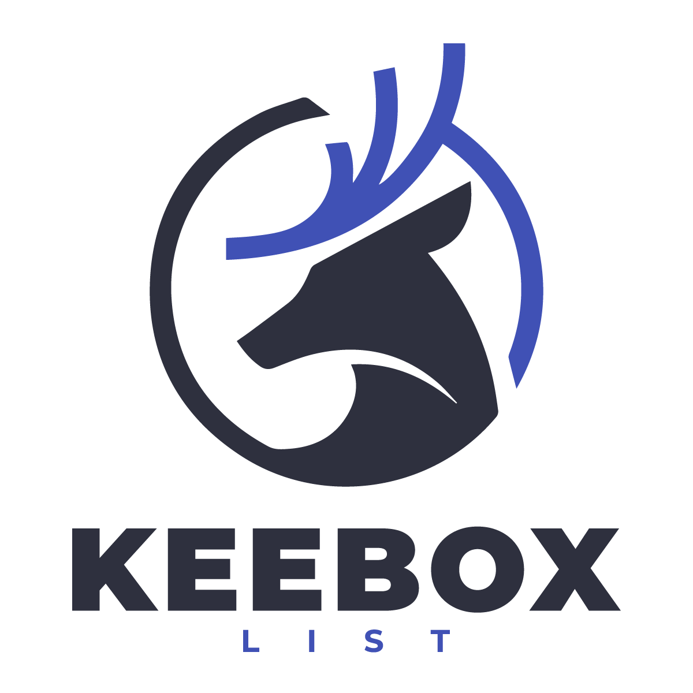

	
	 

	<a href="docs/contributing.md">Contribution guide</a>&nbsp;&nbsp;&nbsp;
	<a href="https://andriksantos.github.io/keebox"><code> 🔥 VISIT THE PAGE developerresources.xyz OFFICIAL 🔥 </code></a>&nbsp;&nbsp;&nbsp;
	<a href="docs/code-of-conduct.md">Code of conduct</a>&nbsp;&nbsp;&nbsp;

	Your contributions are always welcome! 😎

---

# _Welcome to **KEEBOX LIST ™**_

This repository is a valuable resource for anyone looking to boost their career in software development. 💡 The division of resources by programming language makes it easy to find the information you need, and the focus on including frameworks, libraries, and other resources makes it a comprehensive resource for all types of projects. **_off-limits project!_**

By providing access to a wealth of information in one centralized location, this repository saves time and effort for developers who would otherwise need to search multiple sources to find the information they need. Additionally, the open-source nature of the repository means that anyone can contribute,     making it a community-driven resource that is always growing and improving.

Whether you're a beginner or an experienced programmer, this repository has something to offer. From learning new programming languages to discovering new tools and frameworks, it provides a wealth of information that can help you take your skills to the next level. If you're looking to advance your career in software development, this repository is definitely worth checking out.

If you are interested in contributing to this repository, you can do so, but first read the [Contribution Guidelines](docs/contributing.md) 👌🏻

---

## Thumbs | Imgs

	
	 

*Website Official:* [developerresources.xyz](developerresources.xyz)

---
## Share on
* <a href="https://twitter.com/intent/tweet?url=https://developerresources.xyz/&text=This%20is%20a%20Compilation%20of%20programming%20resources%20to%20boost%20your%20career%20in%20the%20world%20of%20software%20development.%20%F0%9F%92%A1%20Amazing%20lists%20on%20all%20kinds%20of%20cool%20topics,%20awesome%20framework,%20libraries,%20software%20and%20resources%20for%20your%20off-limits%20project!">Share in Twitter</a>
* <a href="https://www.linkedin.com/shareArticle?mini=true&url=https://developerresources.xyz/">Share in LinkedIn</a>
* <a href="https://www.facebook.com/sharer/sharer.php?u=https://developerresources.xyz/">Share in Facebook</a>

---

If you have any question about this opinionated list, do not hesitate to contact me [andricksantos1@gmail.com](mailto:andricksantos1@gmail.com) on Gmail or open an issue on GitHub.

---

[let's go up](#welcome-to-amazing-) ☝🏻	